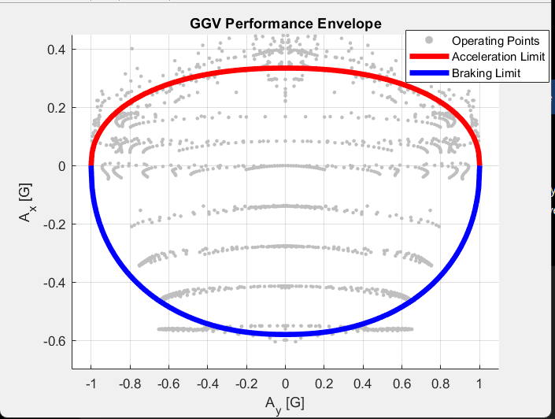
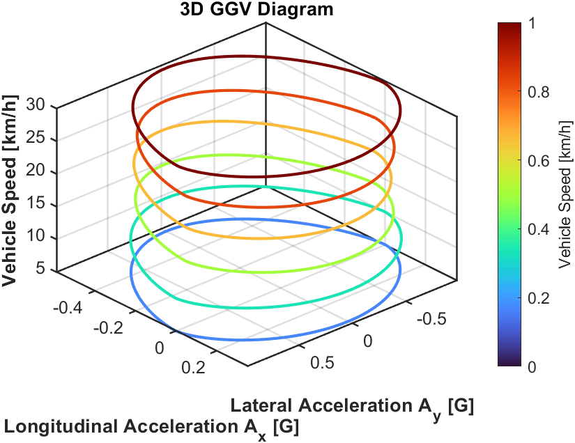

# Formula Student EV GGV Generation

## Overview

This project develops a MATLAB/Simulink-based GGV (Longitudinal-Lateral Acceleration) generation framework for a Formula Student Electric Vehicle.

The objective is to determine the vehicle's achievable acceleration limits by combining a vehicle dynamics model, wheel dynamics, powertrain limitations, and tire force calculations.

The generated GGV diagram is subsequently used within the Lap Time Simulator to determine vehicle performance limits around a race circuit.

---

## Methodology

The workflow used for GGV generation is:

Driver Inputs
→ Powertrain Model
→ Wheel Dynamics
→ Tire Force Generation
→ Vehicle Body 3DOF Dual Track Model
→ Longitudinal & Lateral Acceleration Calculation
→ GGV Envelope Generation

---

## Vehicle Parameters

| Parameter | Value |
|------------|------------|
| Vehicle Mass | 300 kg |
| Wheelbase | 1.6 m |
| CG Height | 0.30 m |
| Wheel Radius | 0.30 m |
| Tire Friction Coefficient | 1.0 |
| Vehicle Configuration | Rear Wheel Drive |
| Maximum Motor Torque | 60 Nm |

---

## Simulation Model

The GGV generation model was developed in MATLAB/Simulink using:

- Vehicle Body 3DOF Dual Track Model
- Wheel Dynamics Model
- Powertrain Model
- Steering System
- Differential Model
- Custom Tire Force Model

The model evaluates vehicle performance over multiple combinations of:

- Vehicle Speed
- Steering Input
- Throttle Input
- Brake Input

The resulting acceleration data is stored and processed to generate the GGV envelope.

---

## 2D GGV Envelope

### Key Results

| Metric | Value |
|----------|----------|
| Maximum Lateral Acceleration | ±1.0 g |
| Maximum Longitudinal Acceleration | +0.35 g |
| Maximum Braking Deceleration | -0.58 g |

---

## 3D GGV Surface

The 3D GGV surface illustrates the relationship between:

- Vehicle Speed
- Longitudinal Acceleration
- Lateral Acceleration

This representation provides a more complete visualization of the vehicle's performance envelope across the operating speed range.

---

## Generated Data

The simulation produces:

- Raw GGV Table
- Speed Dependent Acceleration Limits
- Longitudinal Acceleration Envelope
- Lateral Acceleration Envelope

The generated data is used directly by the Lap Time Simulator to determine vehicle speed limits and acceleration capability around the track.

---

## Future Improvements

- Load Sensitive Tire Model
- Aerodynamic Downforce Model
- Temperature Dependent Tire Properties
- Combined Slip Optimization
- Driver Optimization Algorithms

---

## Related Project

This module forms part of the complete:

**Formula Student EV Lap Time Simulator**

where the generated GGV envelope is used for vehicle performance prediction and lap time calculation.

---

## Author

**Aayushman Singh**

Mechanical Engineering

SVNIT Surat
