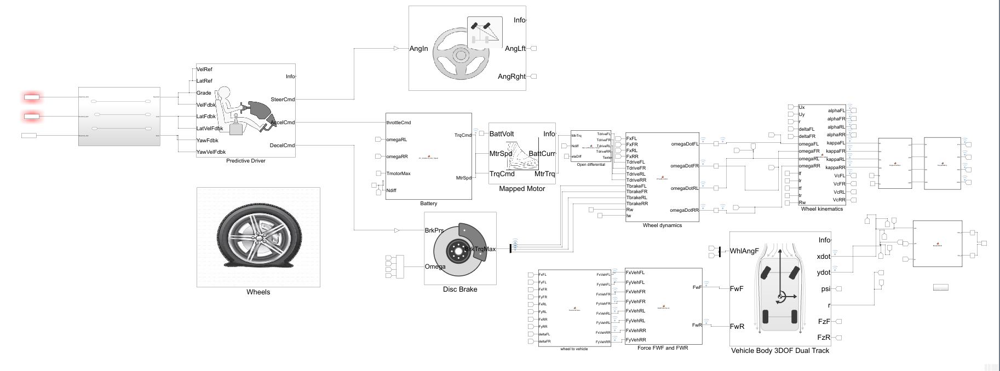
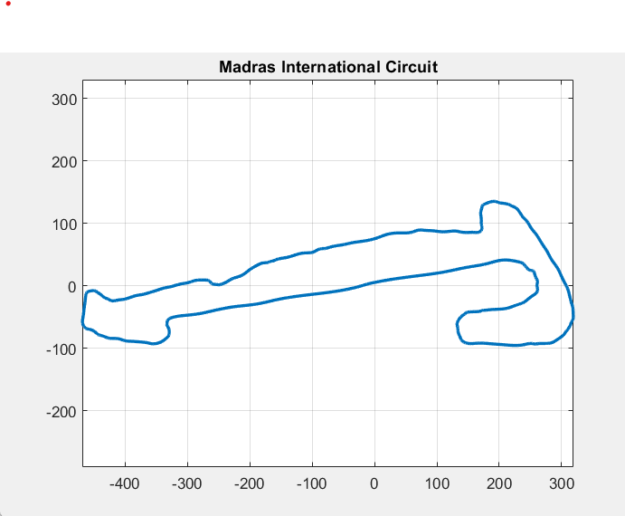
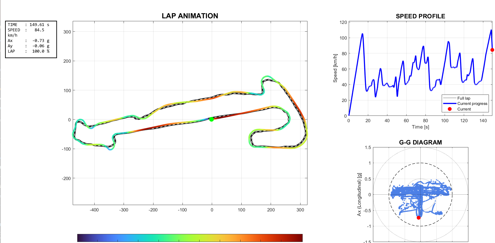

# Formula Student EV Lap Time Simulator

## Overview

MATLAB/Simulink lap time simulator developed for a Formula Student electric race car.

The simulator combines:

- Nonlinear tyre model
- 3DOF dual-track vehicle dynamics model
- Electric powertrain model
- Driver controller
- Track-based speed profile generation
- Lap replay visualization

The tool predicts vehicle performance around a race circuit and generates lap time estimates.

---

## Vehicle Architecture

---

## Track Used

---

## Lap Time Result

---

## Key Features

- GGV-based performance limits
- Optimal speed profile generation
- Steering, throttle and braking control
- Vehicle state prediction
- Lap replay visualization
- Formula Student EV vehicle model

---

## Tools Used

- MATLAB
- Simulink
- Vehicle Dynamics Blockset

---

## Applications

- Formula Student
- Vehicle Dynamics
- Lap Time Simulation
- Performance Simulation
- Driver-in-the-loop preparation

